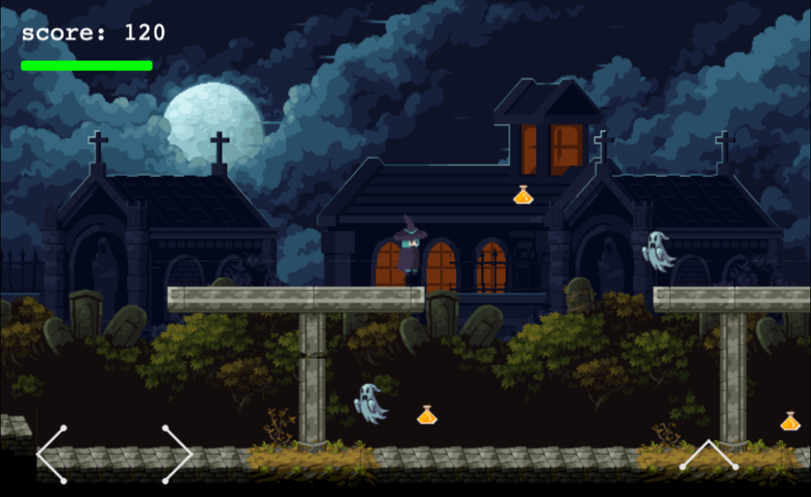

# Haunted Run

### Description  
A 2D haunted platformer built with Phaser 3 for the August Mintbean Hiring Hackathon.

Live Site: https: [blakes24.github.io/haunted-run/](https://blakes24.github.io/haunted-run)

### Getting Started 
- Clone or download the repo.  
- Use any http server to server the files
- Example using [http-server](https://www.npmjs.com/package/http-server):
  - run `npm install --global http-server` to install package
  - run `http-server` from the project root to start server
  - visit http://localhost:8080 to view

### How to play 
- Use the right and left arrows (keyboard or screen) to move forward and back
- Use the up arrow or space bar to jump
- Collect potions to earn more points
- Running into a ghost will reduce your health
- If you health his zero you loose
- Reach the end of the graveyard win

### Tech Stack
- Phaser 3
- JavaScript
- CSS
- HTML 

### Contact 
- Developer: Blakely Burns  
- LinkedIn: [https://www.linkedin.com/in/blakelyburns](https://www.linkedin.com/in/blakelyburns)
- GitHub: [https://github.com/blakes24](https://github.com/blakes24) 
